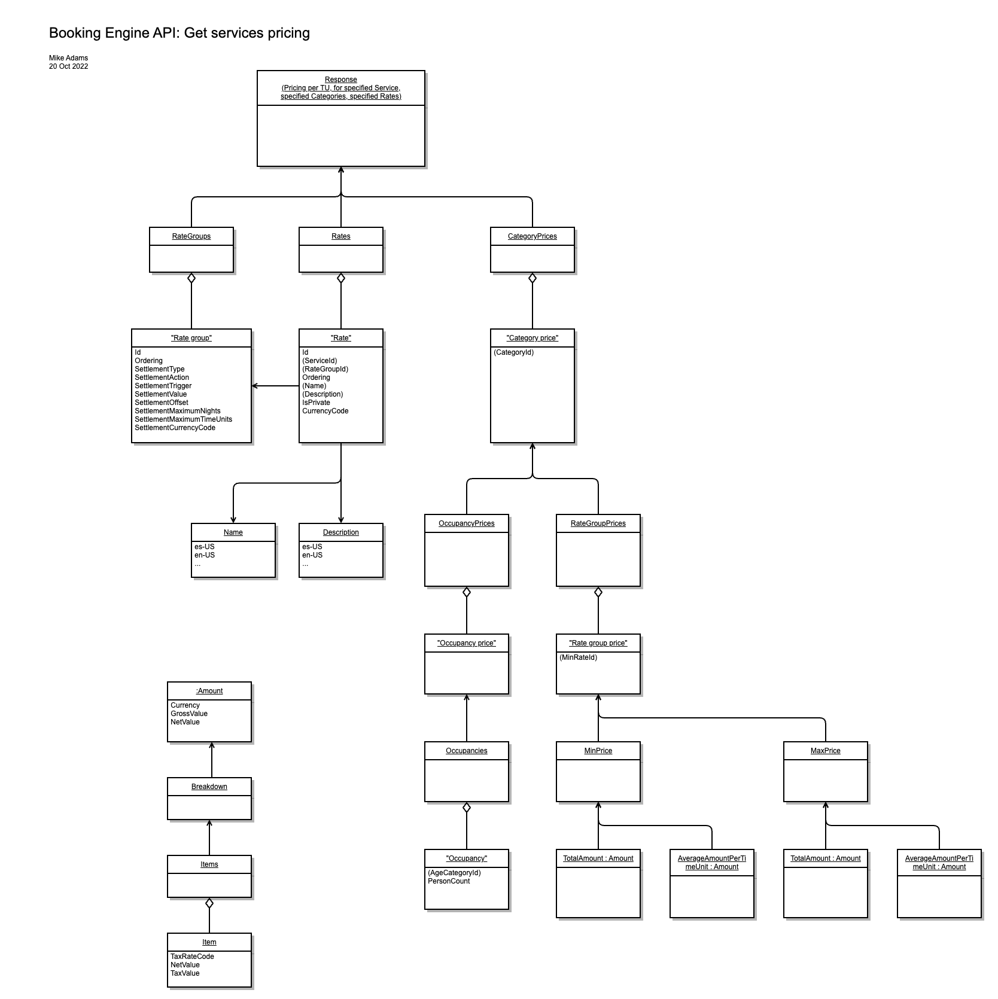

# Services

## Get services availability

Get availability for the specified service for each time unit in the specified date interval.

### Request

`[ApiBaseUrl]/api/distributor/v1/services/getAvailability`

```json
{
    "Client": "My Client 1.0.0",
    "EnterpriseId": "3edbe1b4-6739-40b7-81b3-d369d9469c48",
    "ServiceId": "40665467-5862-4932-a861-aa6b00e2b660",
    "StartUtc": "202-01-01T00:00:00Z",
    "EndUtc": "2022-01-31T00:00:00Z",
    "CategoryIds": ["4037c0ec-a59d-43f1-9d97-d6c984764e8c"],
    "LanguageCode": "en-GB"
}
```

| Property | Type | Contract | Description |
| :-- | :-- | :-- | :-- |
| `Client` | string | required | Identification of the client as described in [Authentication](../guidelines/authentication.md). |
| `EnterpriseId` | string | required | Unique identifier of the enterprise. |
| `ServiceId` | string | required | Unique identifier of the [Service](configuration.md#service) for which availability should be returned. |
| `StartUtc` | string | required | Start date of the requested interval. |
| `EndUtc` | string | required | End date of the requested interval. |
| `CategoryIds` | array of string | optional | Unique identifiers of specific categories for which availability should be returned. If omitted, availability will be returned for all categories. |
| `LanguageCode` | string | optional | Code of the language. [Supported language codes](../guidelines/supported-language-codes.md)  |


### Response

```json
{
  "TimeUnitStartsUtc": [
    "2022-10-04T22:00:00Z",
    "2022-10-05T22:00:00Z",
    "2022-10-06T22:00:00Z"
  ],
  "CategoryAvailabilities": [
    {
      "CategoryId": "ddc48d9f-f21d-422a-b24a-aa6b00e2b77e",
      "Availabilities": [
        56,
        40,
        26
      ]
    },
    {
      "CategoryId": "abcdefg-08ad-4d19-98cc-aa6b00e2999e",
      "Availabilities": [
        0,
        10,
        0
      ]
    }
  ]
}
```

| Property | Type | Contract | Description |
| :-- | :-- | :-- | :-- |
| `TimeUnitStartsUtc` | array of string | required | Each time unit specified in request interval. Values are in UTC timezone in ISO 8601 format. |
| `CategoryAvailabilities` | array of [Category Availability](#category-availability) | required | List of availability counts for each category. Each availability number belongs to TimeUnitStartsUtc linked by same index. |

#### Category Availability
| Property | Type | Contract | Description |
| :-- | :-- | :-- | :-- |
| `CategoryId` | string | required | Identifier of the room category. |
| `Availabilities` | array of number | required | List of availability counts for each TimeUnitStartsUtc linked by same index. |


## Get services pricing

Get pricing for the specified service for each time unit in the specified date interval.

### Request


`[ApiBaseUrl]/api/distributor/v1/services/getPricing`

```json
{
    "Client": "My Client 1.0.0",
    "EnterpriseId": "3edbe1b4-6739-40b7-81b3-d369d9469c48",
    "ServiceId": "40665467-5862-4932-a861-aa6b00e2b660",
    "StartUtc": "202-01-01T00:00:00Z",
    "EndUtc": "2022-01-31T00:00:00Z",
    "CategoryIds": ["4037c0ec-a59d-43f1-9d97-d6c984764e8c"],
    "RateIds": ["4037c0ec-a59d-43f1-9d97-d6c984764e8c"],
    "LanguageCode": "en-GB",
    "CurrencyCode": "EUR",
    "OccupancyData": [
        {
            "AgeCategoryId": "16e8a466-729e-4d32-a221-ade300e410a8",
            "PersonCount": 1
        },
        {
            "AgeCategoryId": "790c82c1-cbe6-4b8d-a45f-ade300e410a8",
            "PersonCount": 1
        }
    ]
}
```

| Property | Type | Contract | Description |
| :-- | :-- | :-- | :-- |
| `Client` | string | required | Identification of the client as described in [Authentication](../guidelines/authentication.md). |
| `EnterpriseId` | string | required | Unique identifier of the enterprise. |
| `ServiceId` | string | required | Unique identifier of the [Service](configuration.md#service) for which availability should be returned. |
| `StartUtc` | string | required | Start date of the requested interval. |
| `EndUtc` | string | required | End date of the requested interval. |
| `CategoryIds` | array of string | optional | Unique identifiers of specific room categories for which pricing should be computed. If omitted, pricing will be computed and returned for all room categories. |
| `RateIds` | array of string | optional | Unique identifiers of specific rates for which pricing should be computed. If omitted, pricing will be computed and returned for all rates. |
| `LanguageCode` | string | optional | Code of the language. [Supported language codes](../guidelines/supported-language-codes.md)  |
| `CurrencyCode` | string | optional | Currency code which should be used for prices in the response. [Supported currency codes](../guidelines/supported-currency-codes.md)  |
| `OccupancyData` | array of [Occupancy Data](hotels.md#occupancy-data) | optional | List of occupancy data. |

### Response

```json
{
  "RateGroups":[
    {
      "Id": "3ede420b-9e9e-4008-abef-abc800c82505",
      "Ordering": 0,
      "SettlementType": "Manual",
      "SettlementAction": "ChargeCreditCard",
      "SettlementTrigger": "Start",
      "SettlementValue": 1.00,
      "SettlementOffset": "P0M0DT0H0M0S",
      "SettlementMaximumNights": null,
      "SettlementMaximumTimeUnits": null,
      "SettlementCurrencyCode": null
    }
  ],
  "Rates":[
    {
      "Id": "f02923a9-ffa3-4d83-a9d7-abc800c81111",
      "ServiceId": "33c75941-c2ec-467e-9797-abc800c8110d",
      "RateGroupId": "3ede420b-9e9e-4008-abef-abc800c82505",
      "Ordering": 0,
      "Name": {
        "es-ES": "Fully Flexible",
        "en-US": "Fully Flexible"
      },
      "Description": {},
      "IsPrivate": false,
      "CurrencyCode": "EUR"
    }
  ],
  "CategoryPrices": [
    {
      "CategoryId": "4037c0ec-a59d-43f1-9d97-d6c984764e8c",
      "OccupancyPrices": [
        {
          "Occupancies": [
            {
              "AgeCategoryId": "16e8a466-729e-4d32-a221-ade300e410a8",
              "PersonCount": 1
            },
            {
              "AgeCategoryId": "790c82c1-cbe6-4b8d-a45f-ade300e410a8",
              "PersonCount": 1
            }
          ]
        }
      ],
      "RateGroupPrices":[
        {
          "MinRateId": "abd865c2-8cc3-4ebc-acad-aca100b125b9",
          "MinPrice": {
            "TotalAmount": {
              "Currency": "EUR",
              "GrossValue": 83.41,
              "NetValue": 77.65,
              "Breakdown": {
                "Items": [
                  {
                    "TaxRateCode": null,
                    "NetValue": 18.11,
                    "TaxValue": 0.0
                  },
                  {
                    "TaxRateCode": "CZ-L",
                    "NetValue": 57.50,
                    "TaxValue": 5.76
                  },
                  {
                    "TaxRateCode": "CZ-Z",
                    "NetValue": 2.04,
                    "TaxValue": 0.00
                  }
                ]
              }
            },
            "AverageAmountPerTimeUnit": {
              "Currency": "EUR",
              "GrossValue": 41.71,
              "NetValue": 38.83,
              "Breakdown": {
                "Items": [
                  {
                    "TaxRateCode": null,
                    "NetValue": 9.06,
                    "TaxValue": 0.0
                  },
                  {
                    "TaxRateCode": "CZ-L",
                    "NetValue": 28.75,
                    "TaxValue": 2.88
                  },
                  {
                    "TaxRateCode": "CZ-Z",
                    "NetValue": 1.02,
                    "TaxValue": 0.00
                  }
                ]
              }
            }
          },
          "MaxPrice": {
            "TotalAmount": {
              "Currency": "EUR",
              "GrossValue": 20020.15,
              "NetValue": 18201.97,
              "Breakdown": {
                "Items": [
                  {
                    "TaxRateCode": null,
                    "NetValue": 18.11,
                    "TaxValue": 0.0
                  },
                  {
                    "TaxRateCode": "CZ-L",
                    "NetValue": 18181.82,
                    "TaxValue": 1818.18
                  },
                  {
                    "TaxRateCode": "CZ-Z",
                    "NetValue": 2.04,
                    "TaxValue": 0.00
                  }
                ]
              }
            },
            "AverageAmountPerTimeUnit": {
              "Currency": "EUR",
              "GrossValue": 10010.08,
              "NetValue": 9100.99,
              "Breakdown": {
                "Items": [
                  {
                    "TaxRateCode": null,
                    "NetValue": 9.06,
                    "TaxValue": 0.0
                  },
                  {
                    "TaxRateCode": "CZ-L",
                    "NetValue": 9090.91,
                    "TaxValue": 909.09
                  },
                  {
                    "TaxRateCode": "CZ-Z",
                    "NetValue": 1.02,
                    "TaxValue": 0.00
                  }
                ]
              }
            }
          }
        }
      ]
    }
  ]
}
```

| Property | Type | Contract | Description |
| :-- | :-- | :-- | :-- |
| `RateGroups` | array of [Rate group](hotels.md#rate-group) | required | Information about all available rate groups. |
| `Rates` | array of [Rate](hotels.md#rate) | required | Information about all available rates. |
| `CategoryPrices` | array of [Category price](#category-price) | required | Prices for all specified categories. |

#### Category price
| Property | Type | Contract | Description |
| :-- | :-- | :-- | :-- |
| `CategoryId` | string | required | Unique identifier of category. |
| `OccupancyPrices` | array of objects with arrays of [Occupancy](#occupancy) | required | List of occupancies for age categories against which rate group prices are supplied. When `OccupancyData` request parameter is not provided, the prices for the combination of the default adult and a single child category is generated for up to 3 person counts. |
| `RateGroupPrices` | array of [Rate group price](#rate-group-price) | required | Prices for the given category for each of the occupancy bands specified in OccupancyPrices. |

#### Occupancy
| Property | Type | Contract | Description |
| :-- | :-- | :-- | :-- |
| `AgeCategoryId` | string | required | Identifier of age category. |
| `PersonCount` | number | required | Number of persons of this Age category type. |

#### Rate group price
| Property | Type | Contract | Description |
| :-- | :-- | :-- | :-- |
| `MinRateId` | string | required | Unique identifier of rate. |
| `MinPrice` | [Min price](#min-price) objects | required | Minimal price for the specified interval for rate. |
| `MaxPrice` | [Max price](#max-price) objects | required | Maximal price for the specified interval for rate. |

#### Min price
| Property | Type | Contract | Description |
| :-- | :-- | :-- | :-- |
| `TotalAmount` | [Amount](#amount) objects | required | Total price for specified interval. |
| `AverageAmountPerTimeUnit` | [Amount](#amount) objects | required | Price for one timeUnit. (Day/Night) |

#### Max price
| Property | Type | Contract | Description |
| :-- | :-- | :-- | :-- |
| `TotalAmount` | [Amount](#amount) objects | required | Total price for specified interval. |
| `AverageAmountPerTimeUnit` | [Amount](#amount) objects | required | Price for one timeUnit. (Day/Night) |

#### Rate
| Property | Type | Contract | Description |
| :-- | :-- | :-- | :-- |
| `Id` | string | required | Unique identifier of the rate. |
| `Name` | [Localized text](hotels.md#localized-text) | required | Name of the rate localized into all supported languages. |
| `Description` | [Localized text](hotels.md#localized-text) | required | Description of the rate localized into all supported languages. |
| `IsPrivate` | boolean | required | Set to `true` for promotion rate enabled by provided `VoucherCode`. |
| `ServiceId` | string | required | Unique identifier of the [Service](configuration.md#service) to which the rate is bound. |
| `RateGroupId` | string | required | [Rate group](hotels.md#rate-group) Identifier of the rate. |
| `Ordering` | number | required | Number defining the ordering of the rate. |

#### Amount

| Property | Type | Contract | Description |
| :-- | :-- | :-- | :-- |
| `Currency` | string | required | ISO 4217 code of the currency. |
| `GrossValue` | number | required | Gross value of the amount. (Net + sum of `TaxValues`) |
| `NetValue` | number | required | Net value of the amount. |
| `Breakdown.Items` | array of [Complete tax](#complete-tax) | required | List of taxes related to this amount. |


#### Rate
| Property | Type | Contract | Description |
| :-- | :-- | :-- | :-- |
| `Currency` | string | required | Amount currency. |
| `GrossValue` | number | required | Gross value of the amount. (Net + sum of `Breakdown > Items`) |
| `NetValue` | number | required | Net value of the amount. |
| `Breakdown.Items` | array of [Complete tax](#complete-tax) | required | List of taxes related to this amount. |


#### Complete tax

| Property | Type | Contract | Description |
| :-- | :-- | :-- | :-- |
| `TaxRateCode` | string | Unique identifier of the tax rate. |
| `NetValue` | number | required | Net value taxValue is calculated from. |
| `TaxValue` | number | required | Tax value calculated from `NetValue` based on Tax configuration. |

### Response diagram



## Get promoted services

> ### Restricted!
>
> This functionality is currently in beta-test and as such it is subject to change.

Get promoted (upsell) services for a given service and interval with prices in given currency. Returns available promoted services, their pricing, and related resource categories.

### Request

`[ApiBaseUrl]/api/distributor/v1/services/getPromotions`

```json
{
    "Client": "My Client 1.0.0",
    "EnterpriseId": "3edbe1b4-6739-40b7-81b3-d369d9469c48",
    "ServiceId": "40665467-5862-4932-a861-aa6b00e2b660",
    "StartUtc": "2022-01-01T00:00:00Z",
    "EndUtc": "2022-01-31T00:00:00Z",
    "CurrencyCode": "EUR"
}
```

| Property | Type | Contract | Description |
| :-- | :-- | :-- | :-- |
| `Client` | string | required | Identification of the client as described in [Authentication](../guidelines/authentication.md). |
| `EnterpriseId` | string | required | Unique identifier of the enterprise. |
| `ServiceId` | string | required | Unique identifier of the [Service](configuration.md#service) for which promoted services should be returned. |
| `StartUtc` | string | required | Start date of the requested interval. |
| `EndUtc` | string | required | End date of the requested interval. |
| `CurrencyCode` | string | required | Currency code for prices in the response. [Supported currency codes](../guidelines/supported-currency-codes.md) |

### Response

```json
{
  "PromotedServices": [
    {
      "PromotedServiceAssignmentId": "b1e2c3d4-5678-1234-9abc-1234567890ab",
      "PromotedServiceId": "a1b2c3d4-5678-1234-9abc-1234567890ab",
      "PromotedRateId": "c1d2e3f4-5678-1234-9abc-1234567890ab",
      "PromotedServiceTimeUnitPeriod": "Day",
      "PromotedServiceStartOffset": "P0D",
      "PromotedServiceEndOffset": "P0D",
      "PromotedServiceUnitCountLimit": "Unlimited",
      "PromotedServiceReservationIntervalLimit": "InsideParent",
      "PromotedServiceDefaultOccupancyData": [
        { "AgeCategoryId": "16e8a466-729e-4d32-a221-ade300e410a8", "PersonCount": 2 }
      ],
      "PromotedServiceOptions": { "ProRataCharging": false },
      "PromotedRateName": { "en-US": "Flexible Rate" },
      "PromotedResourceCategoryId": "ddc48d9f-f21d-422a-b24a-aa6b00e2b77e",
      "PromotedResourceCategoryName": { "en-US": "Room" },
      "PromotedResourceCategoryDescription": { "en-US": "A nice room" },
      "ImageId": "e1f2a3b4-5678-1234-9abc-1234567890ab",
      "TotalAmount": { "Currency": "EUR", "GrossValue": 100.0, "NetValue": 90.0, "Breakdown": { "Items": [] } },
      "UnitAmount": { "Currency": "EUR", "GrossValue": 50.0, "NetValue": 45.0, "Breakdown": { "Items": [] } },
      "AvailableCount": 5,
      "Ordering": 1,
      "MinPricePerTimeUnit": { "Currency": "EUR", "GrossValue": 50.0, "NetValue": 45.0, "Breakdown": { "Items": [] } }
    }
  ],
  "ResourceCategories": [
    {
      "CategoryId": "ddc48d9f-f21d-422a-b24a-aa6b00e2b77e",
      "Name": { "en-US": "Room" },
      "Description": { "en-US": "A nice room" }
    }
  ]
}
```

| Property             | Type                                                | Contract | Description                                                 |
|:---------------------|:----------------------------------------------------|:---------|:------------------------------------------------------------|
| `PromotedServices`   | array of [Promoted service](#promoted-service)      | required | List of available promoted services for the given interval. |
| `ResourceCategories` | array of [Room categories](hotels.md#room-category) | required | List of resource categories related to promoted services.   |

#### Promoted service
| Property                                  | Type                                                | Contract | Description                                                 |
|:------------------------------------------|:----------------------------------------------------|:---------|:------------------------------------------------------------|
| `PromotedServiceAssignmentId`             | string                                              | required | Unique identifier of the promoted service assignment.       |
| `PromotedServiceId`                       | string                                              | required | Unique identifier of the promoted service.                  |
| `PromotedRateId`                          | string                                              | required | Unique identifier of the promoted rate.                     |
| `PromotedServiceTimeUnitPeriod`           | string                                              | required | Time unit period (e.g. Day, Hour) for the promoted service. |
| `PromotedServiceStartOffset`              | string                                              | required | Start offset for the promoted service (ISO 8601 duration).  |
| `PromotedServiceEndOffset`                | string                                              | required | End offset for the promoted service (ISO 8601 duration).    |
| `PromotedServiceUnitCountLimit`           | string                                              | required | Unit count limit for the promoted service.                  |
| `PromotedServiceReservationIntervalLimit` | string                                              | required | Reservation interval limit for the promoted service.        |
| `PromotedServiceDefaultOccupancyData`     | array of [Occupancy data](hotels.md#occupancy-data) | required | Default occupancy data for the promoted service.            |
| `PromotedServiceOptions`                  | object                                              | required | Options for the promoted service (e.g. ProRataCharging).    |
| `PromotedRateName`                        | [Localized text](hotels.md#localized-text)          | required | Name of the promoted rate.                                  |
| `PromotedResourceCategoryId`              | string                                              | required | Resource category id for the promoted service.              |
| `PromotedResourceCategoryName`            | [Localized text](hotels.md#localized-text)          | required | Name of the resource category.                              |
| `PromotedResourceCategoryDescription`     | [Localized text](hotels.md#localized-text)          | required | Description of the resource category.                       |
| `ImageId`                                 | string                                              | optional | Image id for the resource category.                         |
| `TotalAmount`                             | [Amount](#amount)                                   | optional | Total price for the promoted service.                       |
| `UnitAmount`                              | [Amount](#amount)                                   | optional | Price per time unit for the promoted service.               |
| `AvailableCount`                          | number                                              | optional | Number of available promoted services.                      |
| `Ordering`                                | number                                              | required | Ordering of the promoted service.                           |
| `MinPricePerTimeUnit`                     | [Amount](#amount)                                   | required | Minimal price per time unit for the promoted service.       |
