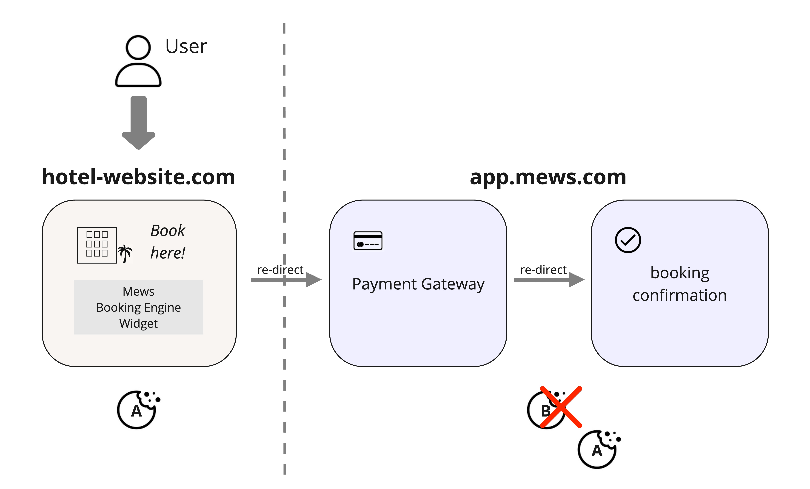
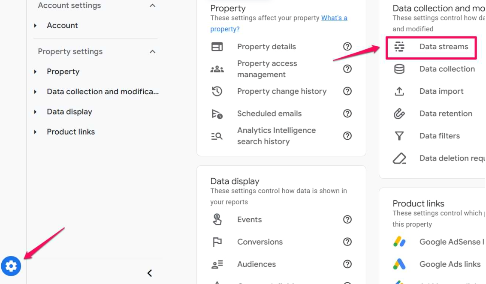
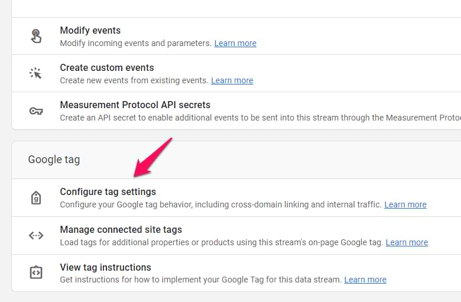
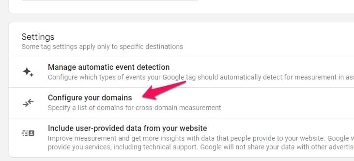
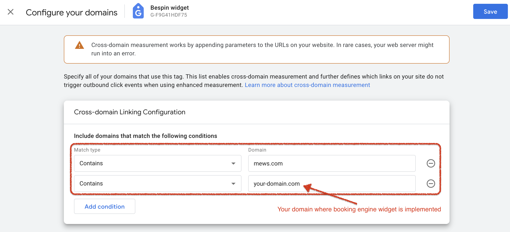

# Google Analytics cross-domain tracking

> **Notice of usage:** Google Tag Manager (GTM) and Google Analytics 4 (GA4) are third party services and we provide this integration as is.
We support a set of custom events and Data Layer variables for use with GTM and GA4, however we have no control over what happens to them and how they are used. The basic setup examples we provide have been tested and verified to work with the Mews Booking Engine, however if you need a more complex setup then we cannot provide the support to do so and we recommend to ask a specialist to set it up and test it for you.

## What is cross-domain tracking?

In Google Analytics 4 (GA4), cross-domain tracking is a way of tracking user activity across multiple domains, e.g. across a customer website and a shopping cart. Without configuring cross-domain tracking, Google will create new cookies for each visit and think that it is two users and two sessions, instead of just the same user in the same session.

## Why is it important?

This is particularly important for booking engines using the **Mews Booking Engine Widget**, because to take a payment the user is directed to a payment gateway on the Mews domain and then redirected back to a confirmation screen, and these are separate domains to the main booking website domain.

Without configuring cross-domain tracking, a visitor who completes a booking as described would be tracked incorrectly. The visitor would appear as two separate users in Google Analytics, resulting in disjointed sessions. Additionally, the referral source attribution would be compromised, potentially misrepresenting the origin of the traffic.

"For the booking engine widget, the Google Linker query parameter has been implemented to maintain session continuity. Below is an illustration of how it functions."

## How to configure cross-domain tracking

### Step 1: Go to the data stream in Google Analytics Admin
- Go to the Google Analytics **Admin** page
- Access **Data streams**
- Select a web data stream
- Ensure you choose the correct web data stream associated with your site

### Step 2: Go to configure domains for your tags
- In the web stream details, select **Configure tag settings**

- Select **Configure your domains**

### Step 3: Manually add the missing domains
- Include both `mews.com` and your domain (e.g. `your-domain.com`)
- To manually add a new domain, select **Add condition** under **Include domains that match the following condition**
- Select **Save** to save your changes

## References

- [\[GA4\] Set up cross-domain measurement](https://support.google.com/analytics/answer/10071811)
