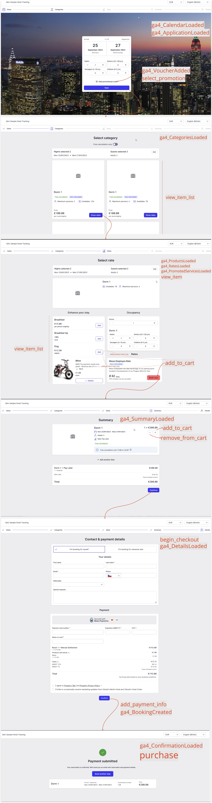

# Google Triggers Reference

> **Notice of usage:** Google Tag Manager (GTM) and Google Analytics 4 (GA4) are third party services and we provide this integration as is.
We support a set of custom events and Data Layer variables for use with GTM and GA4, however we have no control over what happens to them and how they are used. The basic setup examples we provide have been tested and verified to work with the Mews Booking Engine, however if you need a more complex setup then we cannot provide the support to do so and we recommend to ask a specialist to set it up and test it for you.

This reference provides details of **custom events** and **Data Layer variables** generated within the Booking Engine, which can be used to trigger analytics tags to fire, i.e. to send data to Google Analytics.
You will need to reference these events and variables when setting up tag _triggers_ in Google Tag Manager.

## Contents

* [Data Layer variables](#data-layer-variables)
* [Custom events](#custom-events)
* [GA4 pageview events](#ga4-pageview-events)
* [GA4 eCommerce events](#ga4-ecommerce-events)
* [Illustration of GA4 events in the Booking Engine](#illustration-of-ga4-events-in-the-booking-engine)

## Data Layer variables

All event data is passed to Google Tag Manager through a _Data Layer_.

> ### What is a Data Layer?
> A Data Layer is a Javascript object in a website or app that collects analytics data in a standardized way. It acts as a layer between the site and the tag management system.
> The layer stores values, such as page name and URL, that are populated automatically when a visitor uses the site.
> The data is transferred into tag management variables and can be used to activate triggers in your tag configurations.
> [Google Help — The data layer](https://support.google.com/tagmanager/answer/6164391?hl=en)

To use data from the Data Layer in your tags, in the GTM configuration set up a _Variable_ with a suitable name as a Data Layer Variable (DLV), like this:


The [Custom events](#custom-events) reference below describes which Data Layer Variables are relevant to which custom events.

> **Prices:** Note all prices currently presented via the Data Layer are gross prices, i.e. including taxes and fees.

## Custom events

**GA4 pageview events**

* [ga4_ApplicationLoaded](#ga4_applicationloaded)
* [ga4_VoucherAdded](#ga4_voucheradded)
* [ga4_PropertiesLoaded](#ga4_propertiesloaded)
* [ga4_CalendarLoaded](#ga4_calendarloaded)
* [ga4_CategoriesLoaded](#ga4_categoriesloaded)
* [ga4_RatesLoaded](#ga4_ratesloaded)
* [ga4_ProductsLoaded](#ga4_productsloaded)
* [ga4_PromotedServicesLoaded](#ga4_promotedservicesloaded)
* [ga4_SummaryLoaded](#ga4_summaryloaded)
* [ga4_DetailsLoaded](#ga4_detailsloaded)
* [ga4_BookingCreated](#ga4_bookingcreated)
* [ga4_ConfirmationLoaded](#ga4_confirmationloaded)

**GA4 eCommerce events**

* [select_promotion](#select_promotion)
* [view_item_list](#view_item_list)
* [add_to_cart](#add_to_cart)
* [remove_from_cart](#remove_from_cart)
* [begin_checkout](#begin_checkout)
* [add_payment_info](#add_payment_info)
* [purchase](#purchase)

### Data Layer Variables in events

Each event is fired with a standard set of data:

| Data Layer Variable Name | Description |
| :-- | :-- |
| eventName | Name of the event, in readable form without prefix, e.g. `Voucher Added`. |
| trackingConsents | [Tracking consents](#tracking-consents) applied at the time the event was created. |

If a user selects a hotel or property in the Booking Engine, information about it is also added to the event. In _Singlehotel_ mode, the property is always selected.

| Data Layer Variable Name | Description |
| :-- | :-- |
| hotelName | Name of the hotel or property |
| hotelId | Unique identifier of the hotel or property |
| enterpriseName | Array with name of the enterprise (hotel / property) in each supported language |

Pageload events with the 'ga4_' prefix also have the following attributes available in the Data Layer:

| Data Layer Variable Name | Description |
| :-- | :-- |
| page_location | URL style location, to be used for tracking URL |
| page_title | Human readable name of page or screen|

Some events expose additional DLVs. These are described separately for each event.

### Tracking consents

| Name | Type | Contract | Purpose |
| :-- | :-- | :-- | :-- |
| advertising | boolean | required | Advertising, e.g. used to help advertisers deliver more relevant advertising, or to limit how many times you see an advertisment. |
| functional | boolean | required | Functional, non-essential functionality, e.g. remembering user choices made in the past. |
| necessary | boolean | required | Necessary functionality. |
| performance | boolean | required | Performance, e.g. collecting information about how users use a website; data are anonymized. |

## GA4 pageview events

### ga4_ApplicationLoaded

* Event which fires when the application is loaded for the user

### ga4_VoucherAdded

* A voucher has been added into the booking

| Data Layer Variable Name | Description |
| :-- | :-- |
| voucherCode | Code of voucher added by user |

### ga4_PropertiesLoaded

* The properties selection step was loaded for the user

### ga4_CalendarLoaded

* The calendar step has been loaded for the user

### ga4_CategoriesLoaded

* Categories / room selection has been shown to the user

| Data Layer Variable Name | Description |
| :-- | :-- |
| startDate | Start of stay date selected by user |
| endDate | End of stay date selected by user |
| available | Array of room categories which have been shown to user as available |
| unavailable | Array of room categories which have been shown to user as not available |

* Each of the items in arrays follows the google [Item specification for ecommerce](https://developers.google.com/analytics/devguides/collection/ga4/ecommerce?client_type=gtag), for example:

```javascript
{
      item_id: "0d9120fc-72cb-4d23-afe2-ad9000dcb803",
      item_name: "Room 1",
      item_category2: "Jan's Hotel",
      item_category3: "Jan's Hotel City",
      item_brand: "Jan's Hotel Chain",
      affiliation: "Jan's Hotel",
      enterpriseId: "6aaf20ac-a651-4826-b8c0-ad9000dcac3d",
      currency: "EUR",
      price: 10
    },
```

### ga4_RatesLoaded

* Rates selection has been shown to the user

| Data Layer Variable Name | Description |
| :-- | :-- |
| rates | Array of rates shown to user, together with their currency and gross price |

### ga4_ProductsLoaded

* Products selection has been shown to the user

| Data Layer Variable Name | Description |
| :-- | :-- |
| products | Array of products shown to user |

### ga4_PromotedServicesLoaded

* Promoted Services has been shown to the user

### ga4_SummaryLoaded

* Summary step has been shown to the user

### ga4_DetailsLoaded

* The final screen with form to fill in has been shown to the user

### ga4_BookingCreated

* Mews created a booking within the PMS. Additional information is available in the `purchase` event.

### ga4_ConfirmationLoaded

* The confirmation screen has been shown to the user. This step is shown after returning from the payment gateway as the final step of the process.

## GA4 eCommerce events

Please follow the [Google guide for tracking eCommerce in GA4](https://developers.google.com/analytics/devguides/collection/ga4/ecommerce). You need to set up events with all mandatory parameters so they are tracked correctly.
We are pushing all available variables into the eCommerce tracking for more advanced setups as well.

### select_promotion

* Voucher has been added to the booking

| Data Layer Variable Name | Description |
| :-- | :-- |
| promotion_id | Array of rates shown to user |

### view_item_list

* List of available rooms shown to user for eCommerce purposes

| Data Layer Variable Name | Description |
| :-- | :-- |
| items | Array of items (rooms / categories) shown to user |

### add_to_cart

* User added room and products to cart

| Data Layer Variable Name | Description |
| :-- | :-- |
| items | Array of items (rooms / categories / products) added by user in reservation |

* Example:

```javascript
{
  event: "add_to_cart",
  items: [
    {
      item_id: "0d9120fc-72cb-4d23-afe2-ad9000dcb803",
      quantity: 1,
      item_name: "Room 1",
      item_variant: "Best Price",
      item_category: "Reservation",
      item_category2: "Jan's Hotel",
      item_category3: "Jan's Hotel City",
      item_brand: "Jan's Hotel Chain",
      affiliation: "Jan's Hotel",
      currency: "EUR",
      price: 42
    },
    {
      item_id: "26c2ec6e-2890-4677-b994-ad9000dce77f",
      quantity: 1,
      item_name: "Dog",
      item_category: "Product",
      item_category2: "Jan's Hotel",
      item_category3: "Jan's Hotel City",
      item_brand: "Jan's Hotel Chain",
      affiliation: "Jan's Hotel"
    }
  ],
  trackingConsents: {
    necessary: true,
    performance: true,
    functional: true,
    advertising: true
  },
  gtm: {uniqueEventId: 54}
}
```

### remove_from_cart

* User removed an item from the cart. See `add_to_cart` for event parameters.

| Data Layer Variable Name | Description |
| :-- | :-- |
| items | Array of items (rooms / categories / products) remover by user in reservation |

### begin_checkout

* User started the process of check-out. See `add_to_cart` for event parameters.

| Data Layer Variable Name | Description |
| :-- | :-- |
| items | Array of items (rooms / categories / products) added by user in reservation |

### add_payment_info

* User added payment information.

| Data Layer Variable Name | Description |
| :-- | :-- |
| payment_type | Payment type, usually `PaymentCard` |
| currency | Currency in which the payment will be done |
| value | Amount of the reservation |
| items | Array of items (rooms / categories / products) added by user in reservation |

### purchase

* Purchase made. This is the most important eCommerce event. We expose many variables in the event which can be used for advanced tracking. See the example for full description.
The Purchase event is triggered on the booking confirmation screen under the following conditions:
    1.	Payment Success: When the user returns from the payment gateway, and the payment is successfully completed.
    2.	Flexible Rates: If the booking selected flexible rates and no payment is required, the Purchase event is triggered immediately upon booking confirmation.

> **Reservation Owner Email Configuration**
> 
> The `reservationOwnerEmail` field is now available in the `ecommerce` section of the purchase event. To enable this feature, it must be configured in Commander:
> 
> **Settings** → **Services** → **{service}** → **Booking engine** → **{booking engine}** → Check **"Collect emails for bookings in Google Tag Manager purchase event"**
> 
> **Reminder:** Only use guest email addresses as permitted by your privacy policy and T&Cs.

* The most important variables are:

| Data Layer Variable Name | Description |
| :-- | :-- |
| startDate | Start of stay date selected by user |
| endDate | End of stay date selected by user |
| currency | Currency in which the payment will be done |
| value | Amount of the reservation |
| tax | Amount of tax for the reservation |
| reservationGroupName | ID / Name of the reservation group created in Mews |
| netValue | Value of reservation without taxes |
| grossValue | Value of reservation with all taxes |
| pricingMode | either `gross` for US style of pricing, `net` for EU style of pricing |
| roomCount | Count of rooms in reservation |
| adults | Count of Adults in reservations |
| children | Count of children in reservations |
| ecommerce.reservationOwnerEmail | Email address of the reservation owner (requires booking engine configuration) |
| items | Array of items (rooms / categories / products) added by user in reservation. See example for different types of items |

* Example:

```javascript
{
  event: "purchase",
  eventName: "Purchase",
  ecommerce: {
    transaction_id: "d4166ad6d39856ae206cf0f48738d63fbe864fb3",
    value: 160, // Total price of reservation group
    tax: 17.14, // Total tax of reservation group
    currency: "EUR",
    items: [
      /*
       * Rooms and products added to reservation group. There can be multiple rooms with different dates and confirmation numbers. Similarly, the number of different products can range from none to many.
       *
       * Please note that room prices do not include product costs. Each product's price is specified separately.
       */
      {
        item_id: "d089a328-2876-47a8-9dca-b38700d3193a", // Room category id
        item_name: "Room 1", // Room category name
        item_category: "Reservation",
        item_category2: "Kaer Trolde", // Property name
        item_category3: "Prague", // Property city
        item_brand: "Witcher", // Property chain
        affiliation: "Kaer Trolde",
        currency: "EUR",
        price: 160, // Price of reservation
        netPrice: 142.86, // Price of reservation without taxes
        grossPrice: 160, // Price of reservation with taxes
        pricingMode: "Gross", // Pricing mode (Gross mainly Europe = tax is included in price, Net mainly US = tax non included in price)
        quantity: 1, // Count of rooms of room category
        reservationGroupId: "f94a4f53-ab9c-4847-8e4e-b38700d31923",
        reservationGroupName: "ff-31-10-C35D", // Reservation Group name – can be mapped to export from mews Operations for each reservation
        tax: 17.14, // Tax of reservation
        item_variant: "Non refundable", // Selected rate
        confirmationNumber: "87", // Confirmation number of each reservation to be mapped with Mews operations
        reservationRateName: "Non refundable",
        checkInDate: "2025-10-31", // Check-in day of reservation
        checkOutDate: "2025-11-02", // Check-out day of reservation
        stayDuration: 2, // Count of days in reservation
        adults: 2, // Count of adults in reservation
        children: 0 // Count of children in reservation
      }
    ],
    reservationOwnerEmail: "guest@example.com" // Email address of the reservation owner (when enabled in booking engine configuration)
  },
  affiliation: "Kaer Trolde",
  transaction_id: "d4166ad6d39856ae206cf0f48738d63fbe864fb3",
  currency: "EUR",
  value: 160, // Total price of reservation group
  tax: 17.14, // Total tax of reservation group
  reservationGroupId: "f94a4f53-ab9c-4847-8e4e-b38700d31923", // Reservation Group ID – will be added to export in Mews Operation to identify each reservation group
  reservationGroupName: "ff-31-10-C35D", // Reservation Group name – can be mapped to export from mews Operations for each reservation
  reservationIds: "d089a328-2876-47a8-9dca-b38700d3193a", // Comma separated list of all reservation (item) IDs
  chainName: "Witcher", // Chain name
  netValue: 142.86, // Price without taxes
  grossValue: 160, // Price with taxes
  pricingMode: "Gross", // Pricing mode (Gross mainly Europe = tax is included in price, Net mainly US = tax non included in price)
  roomCount: 1, // Count of rooms
  adults: 2, // Count of adults
  children: 0, // Count of children
  mewsSource: "Mews Booking Engine", // Source identifier
  mewsAppVersion: "5238.0.0", // Booking Engine version
  trackingConsents: {
    necessary: true,
    performance: true,
    functional: true,
    advertising: true
  }, // Tracking consent status
  "gtm.uniqueEventId": 56, // GTM unique event identifier
  items: [
    // Duplicate of ecommerce.items for compatibility
    {
      item_id: "d089a328-2876-47a8-9dca-b38700d3193a",
      item_name: "Room 1",
      item_category: "Reservation",
      item_category2: "Kaer Trolde",
      item_category3: "Prague",
      item_brand: "Witcher",
      affiliation: "Kaer Trolde",
      currency: "EUR",
      price: 160,
      netPrice: 142.86,
      grossPrice: 160,
      pricingMode: "Gross",
      quantity: 1,
      reservationGroupId: "f94a4f53-ab9c-4847-8e4e-b38700d31923",
      reservationGroupName: "ff-31-10-C35D",
      tax: 17.14,
      item_variant: "Non refundable",
      confirmationNumber: "87",
      reservationRateName: "Non refundable",
      checkInDate: "2025-10-31",
      checkOutDate: "2025-11-02",
      stayDuration: 2,
      adults: 2,
      children: 0
    }
  ]
}
```

## Illustration of GA4 events in the Booking Engine
The following annotated screenshots provide a visual illustration of GA4 related events and their respective trigger points within the Booking Engine.


