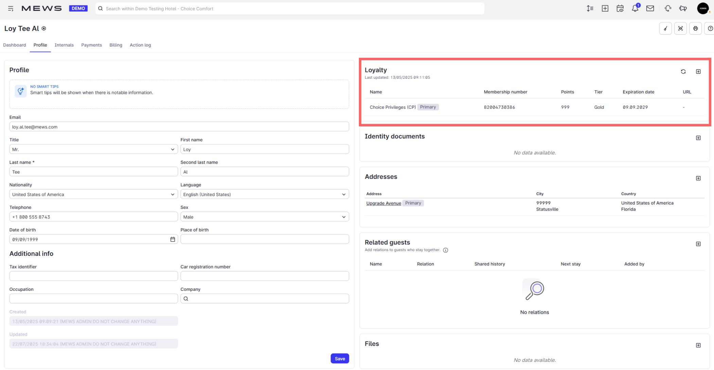

# Loyalty Partner API

The **Mews Loyalty Partner API** enables loyalty program providers to integrate their membership systems with Mews. Once connected, **Mews Operations** users (like front desk staff) can view and manage customer loyalty memberships directly within the Mews guest profile.

<figure><figcaption>
Guest profile in Mews Operations with loyalty membership connected
</figcaption></figure>

### Reverse API model

This integration uses a reverse API pattern: Mews calls your system, not the other way around. You implement a set of operations defined by a Mews-provided OpenAPI specification. Once deployed, Mews calls your API when **Mews Operations** users perform loyalty-related actions.

The integration works as follows:

1. Mews provides an OpenAPI specification describing the operations you must implement.
2. You implement those operations on your system.
3. Mews calls your API when a **Mews Operations** user performs a loyalty action, for example enrolling a customer.

### Changes to this API

See the [Changelog](changelog.md) for notable updates, deprecations, and breaking changes.


The OpenAPI specification is the authoritative source for implementation details. This documentation provides context and examples, but the spec takes precedence.

