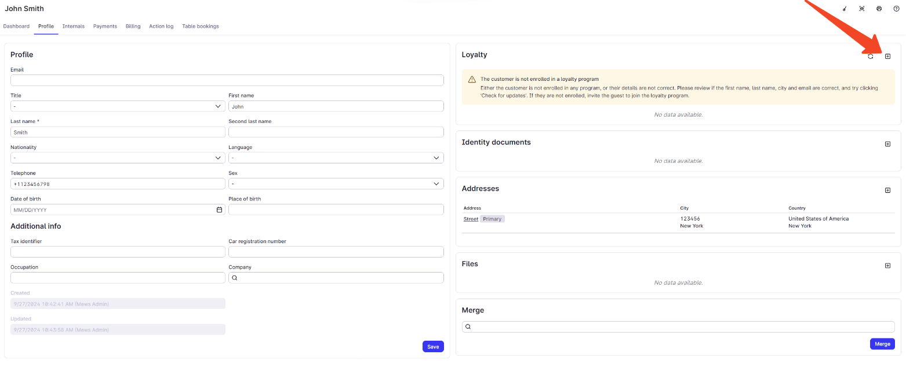
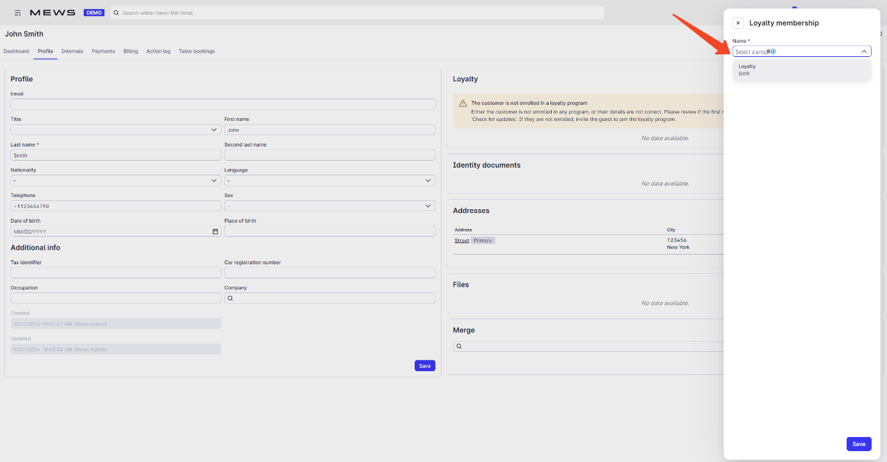
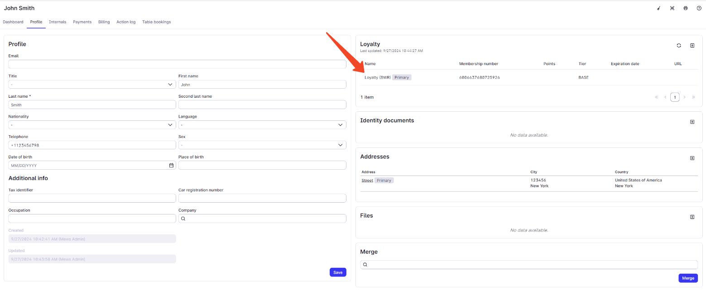

# Enroll customer

**Mews Operations** use the [Enroll a customer](/broken/spaces/NXX5WlJYsdpRtizxNDPz/pages/703d540b7d5b88a00678dd4148b956793bb5b43e#post-members) operation to enroll a Mews customer in the partner loyalty system by creating a new membership.

If the customer already exists in the partner system, return the same response as for a new enrollment: HTTP 200 with the existing membership details.

### Enroll customer

A Mews customer does not have a loyalty membership in the partner system. The Mews operator selects the appropriate loyalty program from a list of available options and sends an enrollment request to the partner system.



#### Add membership

<figure><figcaption>Customer profile screen where the operator adds a new loyalty membership.</figcaption></figure>



#### Select loyalty program

<figure><figcaption>Selection dialog where the operator chooses the appropriate loyalty program.</figcaption></figure>



#### Enrolled customer

<figure><figcaption>Customer profile updated to show the newly created loyalty membership.</figcaption></figure>


