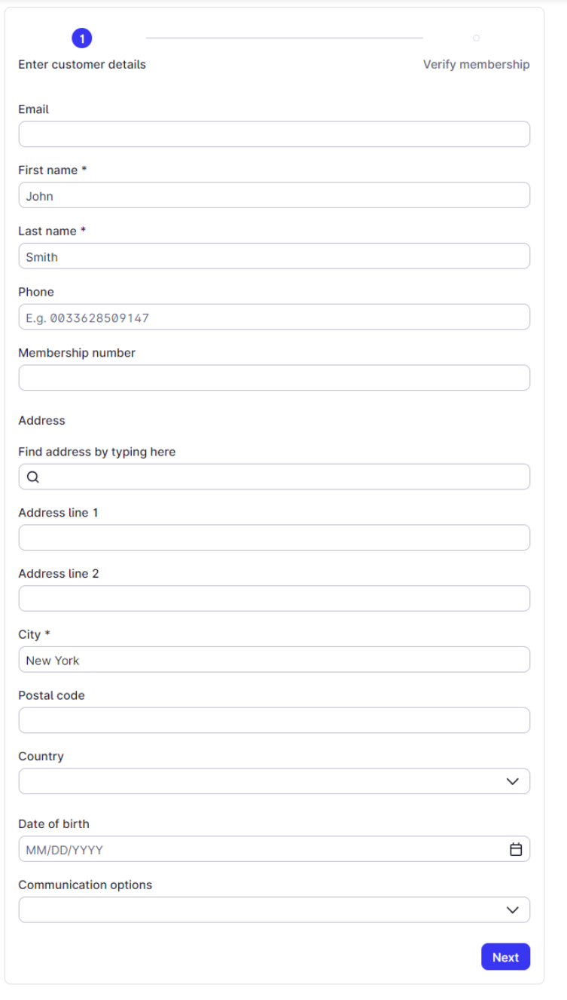
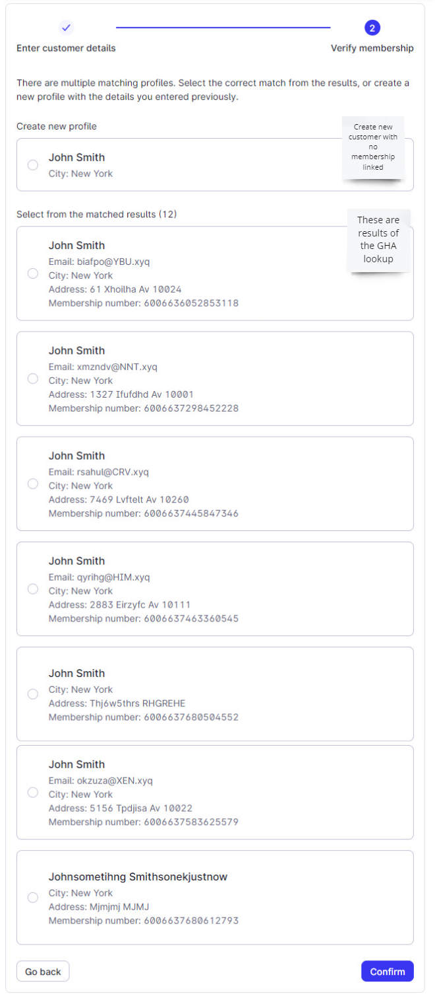
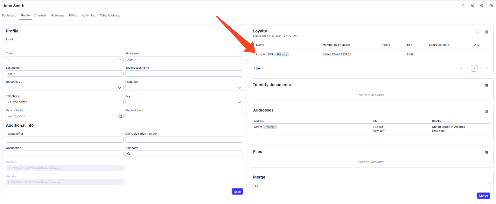
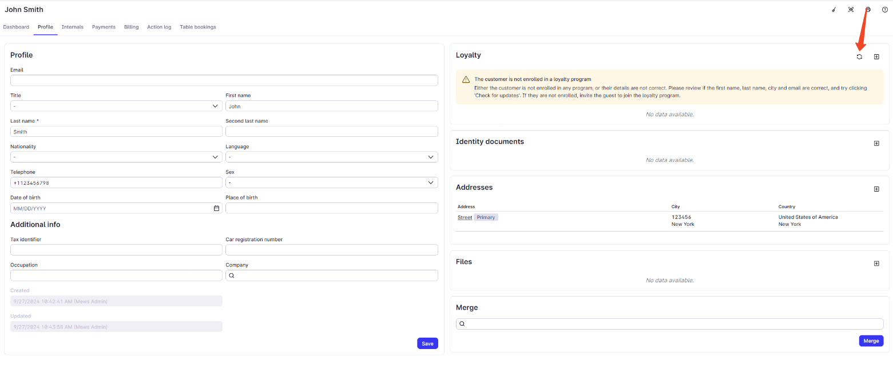
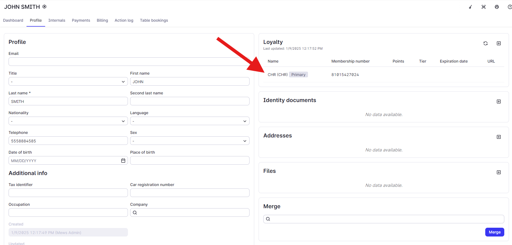
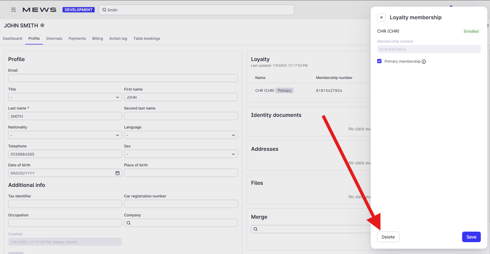

# Link or unlink membership

**Mews Operations** uses the [Link or unlink membership](/broken/spaces/NXX5WlJYsdpRtizxNDPz/pages/ed4f12b8e77f11ff432d80fffbb3f72821702539#put-memberships-link) operation to link an existing membership from the partner loyalty system to a Mews customer profile, or to remove that link.

## Link during new customer creation

Front desk staff are creating a new customer profile in **Mews Operations**. The membership lookup in the partner system returns a matching membership. They select the appropriate membership and link the customer to it.




### Create new customer

<figure><figcaption></figcaption></figure>





### Select matching membership

<figure><figcaption></figcaption></figure>




### Linked membership

<figure><figcaption></figcaption></figure>



## Link from customer profile

Front desk staff view an existing customer profile without a linked membership. They open the lookup screen, which returns a list of matching memberships. They select the correct membership and link the customer to it.




### Customer profile screen

<figure><figcaption></figcaption></figure>




### Select matching membership

<figure><figcaption></figcaption></figure>




### Linked membership

<figure><figcaption></figcaption></figure>



## Unlink

Front desk staff view an existing customer profile with a linked membership. They select the membership program and remove it, unlinking the membership from the customer profile.




### Select membership

<figure><figcaption></figcaption></figure>




### Unlink membership

<figure><figcaption></figcaption></figure>


