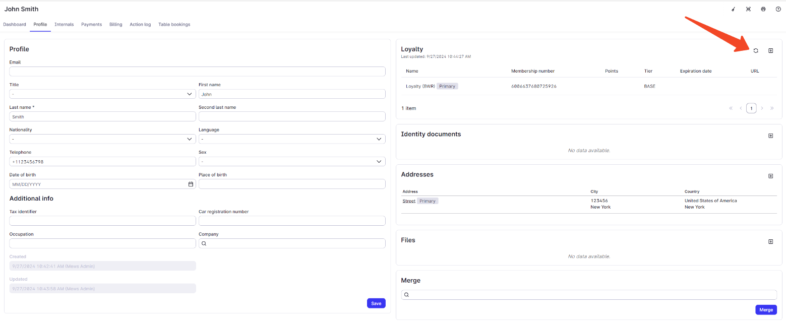

# List memberships

**Mews Operations** use the [List memberships operation](/broken/spaces/NXX5WlJYsdpRtizxNDPz/pages/ed4f12b8e77f11ff432d80fffbb3f72821702539#post-memberships-list) to retrieve current membership data for one or more customers using their `providerMembershipId` values. This operation is used in both manual and automated workflows to keep loyalty data up to date in Mews.

#### Manual membership sync

A Mews operator clicks **Refresh** on a customer profile that is already linked to a membership in the partner system. Mews fetches the latest membership data from the partner system.

<figure><figcaption>Manual membership sync in Mews: operator uses the Refresh button on the customer profile to update membership details from the partner system.</figcaption></figure>

#### Automatic membership sync

Once a day, an automated job identifies customers arriving the next day and fetches the latest membership data for each of them from the partner system.
