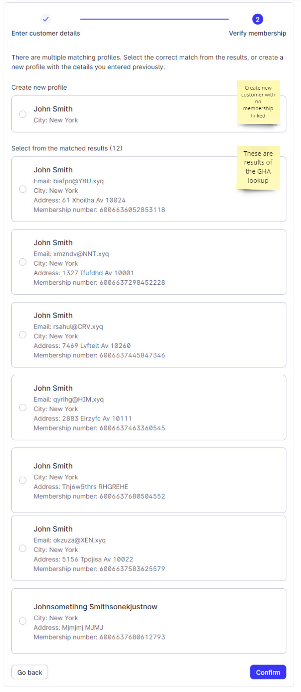
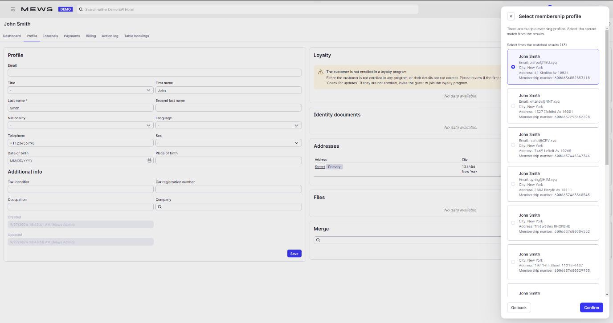

# Search members

**Mews Operations** uses the [Search members](/broken/pages/703d540b7d5b88a00678dd4148b956793bb5b43e#post-members-search) operation to find members in the partner loyalty system matching a specific Mews customer, based on personal information such as name, email, and address.

## New customer creation

Front desk staff are creating a new customer profile. The customer already exists in the partner loyalty system with a membership. During the creation process, Mews queries the partner system for potential matching members and returns a list of matches.



#### Create customer

<figure><figcaption></figcaption></figure>



#### Lookup results

<figure><figcaption></figcaption></figure>



## Link membership to existing customer

A customer already exists in Mews without a linked loyalty membership. Mews queries the partner loyalty system to retrieve a list of possible matches.



#### Customer profile screen

<figure><figcaption></figcaption></figure>



#### Customer lookup result

<figure><figcaption></figcaption></figure>


